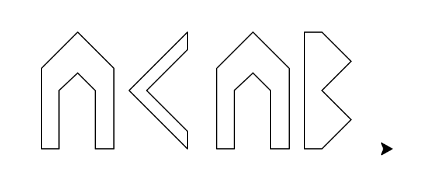
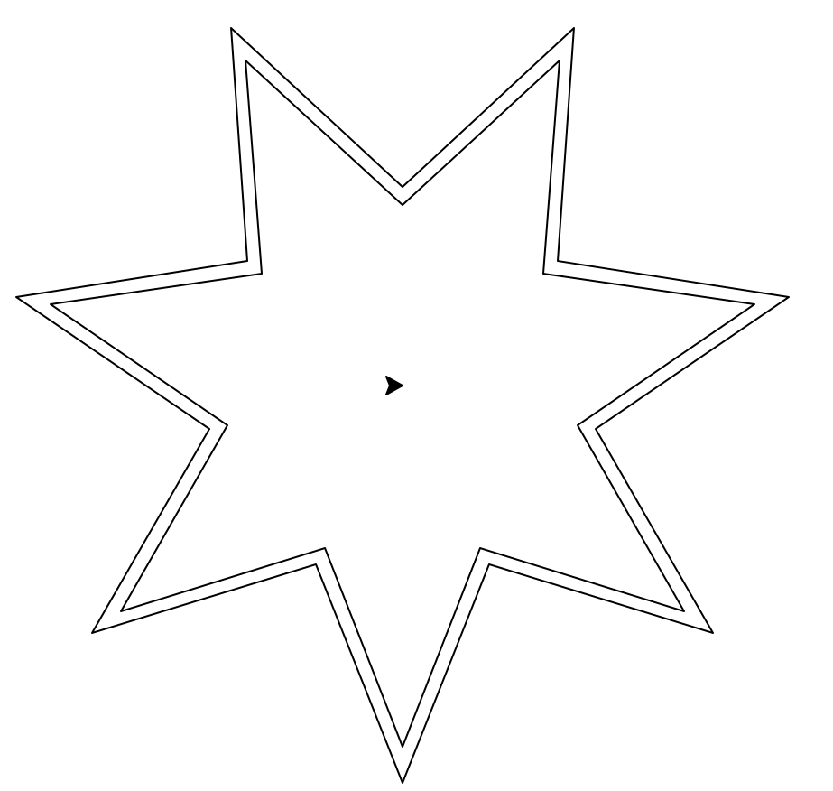
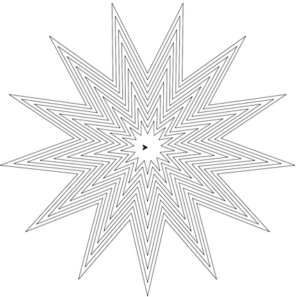
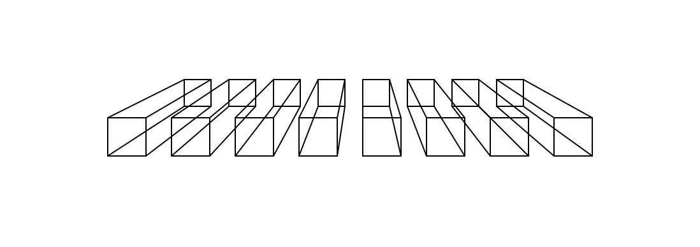
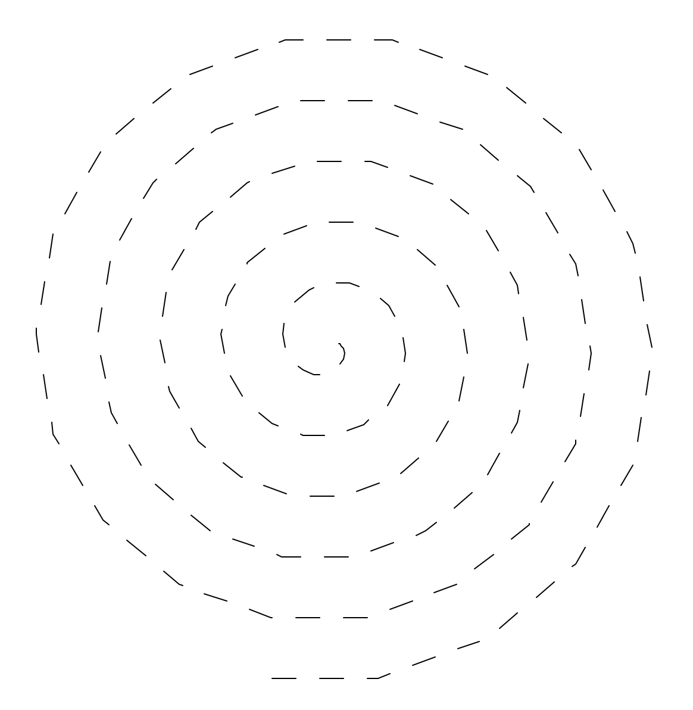
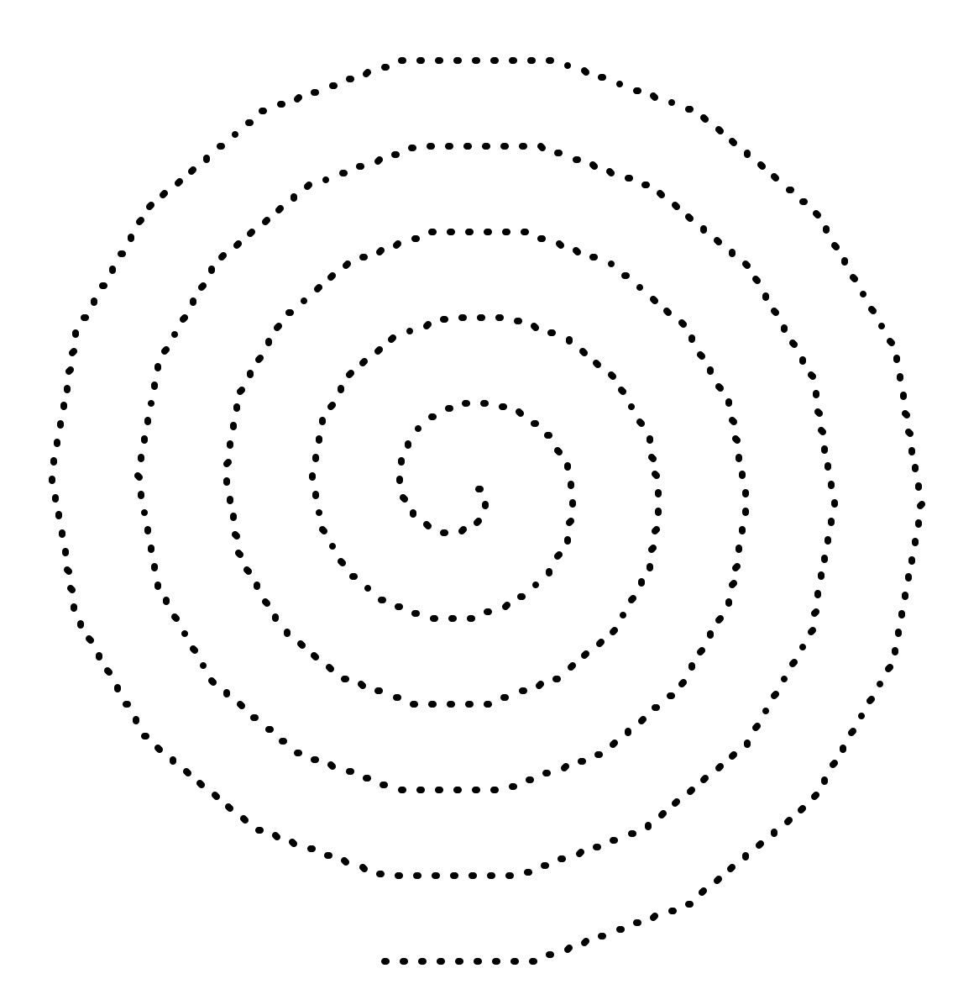
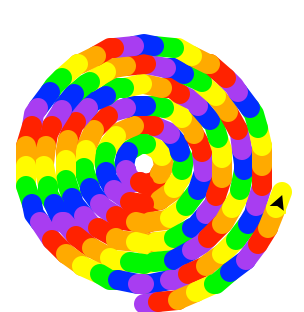

# Drawing

This `package` contains several modules full of useful (or amusing) functions. Here's a description:

## shapes

The `shapes` module contains functions which draw some fancy shapes. Enjoy!

#### `block_a(height)`
Draws the letter A with the given height, and returns the width of the letter.

#### `block_b(height)`
Draws the letter B with the given height, and returns the width of the letter.

#### `block_c(height)`
Draws the letter C with the given height, and returns the width of the letter.

Using these letter functions, you can spell out words (It would be nice to have more letters!):

    from shapes import block_a, block_b, block_c

    def move_space():
        penup()
        forward(75)
        pendown()

    block_a(100)
    move_space()
    block_c(100)
    move_space()
    block_a(100)
    move_space()
    block_b(100)
    input()

#### `fancy_star(inner_radius, outer_radius, number_of_points)`
`fancy_star` takes three arguments: `inner_radius`, `outer_radius`, and `number_of_points`. Then it draws
a zig-zag between points on an inner and outer circle.

.

    from shapes import fancy_star

    fancy_star(100, 200, 7)
    fancy_star(110, 220, 7)

.

    Now, can you think about how you might make this shape above?

#### `square_with_points(size)`
Works just like a regular square, but returns a list of the vertices. For example,

    >>> points = square_with_points(100)
    >>> points
    [(-0.00,-0.00), (100.00,0.00), (100.00,-100.00), (0.00,-100.00)]

#### `add_perspective(points, origin, depth)`
Projects `points` toward `origin`, creating the perception of depth. `depth` should be a number between
0 and 1, indicating how much of the distance between each point and `origin` the perspective line should draw.
Here's an example:

    from shapes import square_with_points, add_perspective
    from movement import fly

    for x in range(-200, 200, 50):
        fly(x, 0)
        points = square_with_points(30)
        add_perspective(points, [0, 100], 0.3)

By the way, if you defined objects with 3-d coordinates, you could draw the whole scene using
this strategy. To find a point's `[x, y]` position on the screen, start at it `[x, y]` coordinates, and
convert the z-coordinate to a `depth` value between 0 and 1. Then move toward `origin` by `depth` times
the distance to the origin. This could be a fun project!

## lines

The `lines` module contains helpers that change how the turtle draws. Each of these is a context manager,
which means that it changes the behavior of the code block which follows it. Think of these as temporarily
changing the rules of the world.

#### `dashes(spacing=20)`
Causes the turtle to draw dashes. `spacing=20` above means `spacing` is an optional argument. If you don't
include it, `spacing` will be set to `20`. For example:

.

    from lines import dashes
    from turtle import forward, pensize

    pensize(4)
    with dashes():
        for side in range(4):
            forward(100)
            right(90)

You may also call dashes with an optional spacing argument, like `with dashes(spacing=3)`.

#### `dots(spacing=10)`
Causes the turtle to draw dots. For example:

.

    from lines import dots

    with dots():
        for i in range(100):
            forward(i)
            right(20)

You may also call dots with an optional spacing argument, like `with dots(spacing=25)`.

#### `rainbow(spacing=10, colors=None)`
Causes the turtle to draw in rainbow colors. Both `spacing` and `colors` are optional; if you call
`rainbow()` with no arguments, you'll get a nice rainbow sequence. For example:

.

    from lines import rainbow
    from turtle import circle, pensize, position, penup, pendown

    pensize(10)
    with rainbow():
        for i in range(10, 100, 10):
            circle(i)
            penup()
            x, y = position()
            sety(y - 10)
            pendown()

You may also call `rainbow` with an optional spacing argument and/or an optional colors argument,
like `with rainbow(spacing=25, colors=["red", "green", "blue"])`.

## movement
The `movement` module contains various functions related to speed and location that you might find handy, especially during your unit 0 project.

#### `fly(x, y)`
`fly` moves the turtle forward to the (x, y) location without drawing.

    from movement import fly

    fly(100, 100)

#### `update_position(x, y=None)`
`update_position` updates the turtle's position, adding x to the turtle's current x and y to the turtle's current y. This may be called in two different ways:

    from movement import update_position

    update_position(10, 20) # Option 1
    update_position([10, 20]) # Option 2

#### `no_delay()`

`no_delay` causes a code block to run instantly. Like the functions in `lines`, `no_delay`
is a context manager which changes how a code block runs. For example:

    from turtle import forward, right
    from movement import no_delay

    with no_delay():
        for i in range(10000):
            forward(100)
            right(180.1)

#### `restore_state_when_finished()`
`restore_state_when_finished` is a context manager which records the turtle's position and heading at the beginning and restores them at the end of the code block.

    from turtle import forward, right
    from movement import restore_state_when_finished

    with restore_state_when_finished():
        for i in range(50):
            forward(i)
            right(20)
